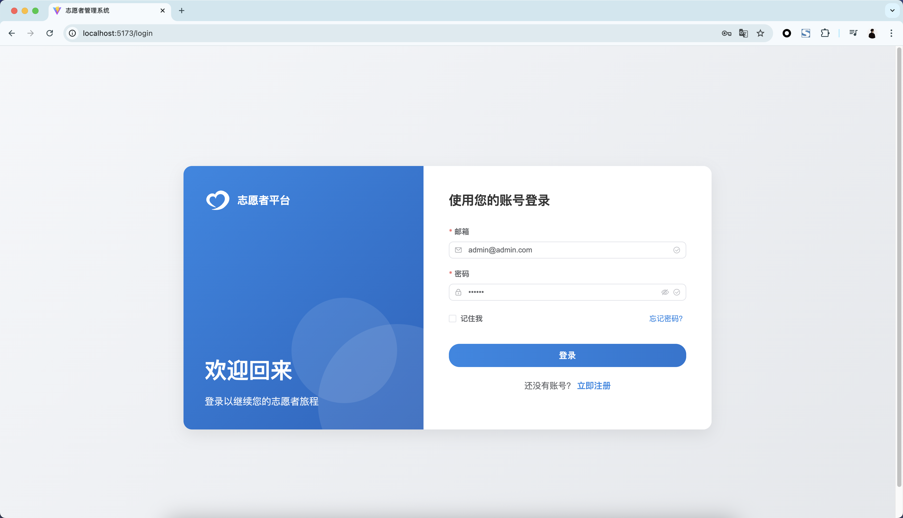
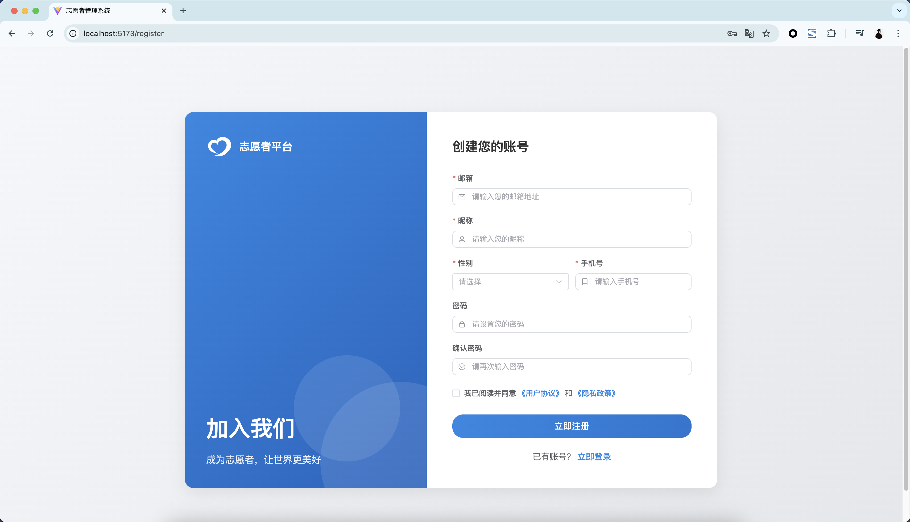
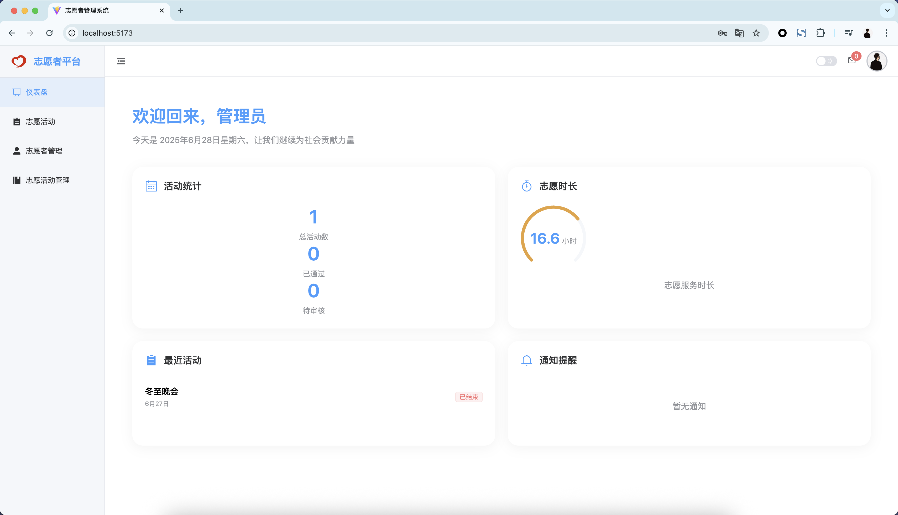
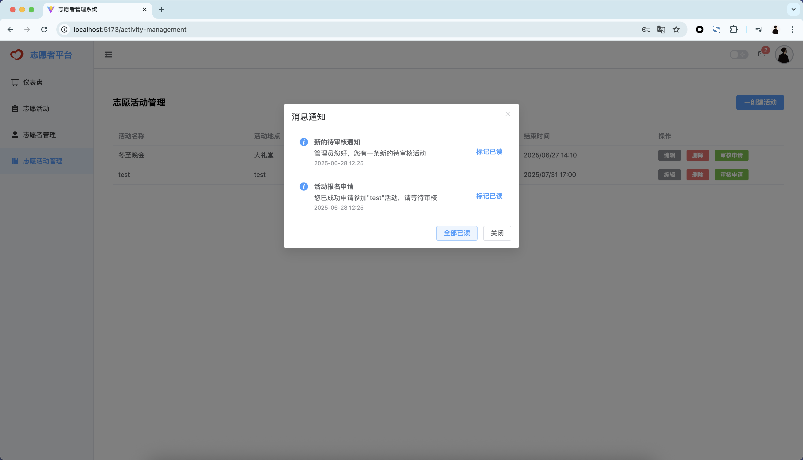
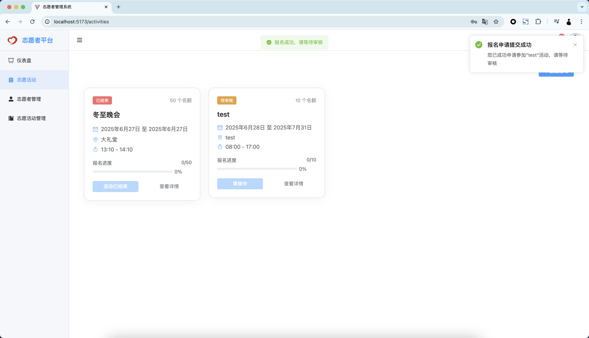
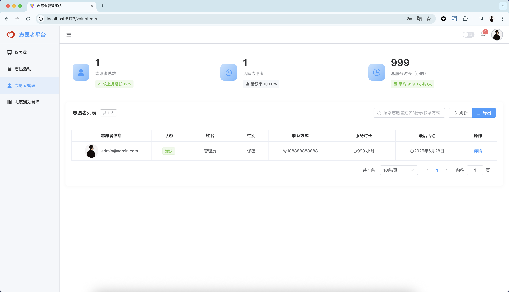
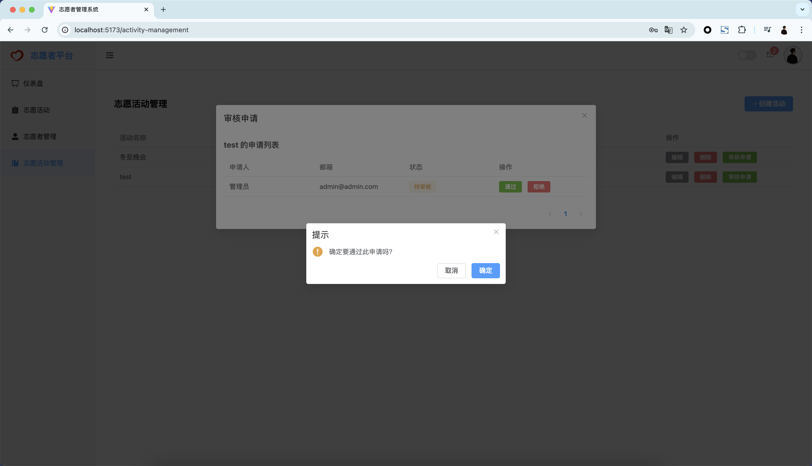

# 志愿者管理系统（前端）

这是一个基于Vue3 + Vite开发的志愿者管理系统前端项目。后端项目请查看：

[Go语言版本](https://github.com/Minshenyao/volunteer-system-backend)

[Java语言版本](https://github.com/Minshenyao/volunteer-system-backend-java)

## 项目简介

一个轻量级的志愿者管理平台的前端实现，基于现代化的前端技术栈，提供美观的用户界面：

- 基于 Vue3 + Vite + Element Plus 开发
- 使用 Vue Router 进行路由管理
- 采用 Pinia 进行状态管理
- 支持文件上传预览

## 主要功能

- 用户认证与权限管理
- 志愿者信息管理
- 活动发布与报名
- 签到管理
- 志愿时长统计
- 文件上传（支持图片预览）

## 技术栈

- Vue 3 + Composition API
- Vite 构建工具
- Element Plus UI组件库
- Vue Router 路由管理
- Pinia 状态管理
- Axios 请求库
- ESLint + Prettier 代码规范

## 快速开始

### 1. 获取代码
```bash
# 下载代码
git clone https://github.com/Minshenyao/volunteer-system-frontend.git

# 进入项目目录
cd volunteer-system-frontend

# 安装依赖
npm install
```

### 2. 开发环境配置
在项目根目录创建 `.env` 文件：

```
VITE_API_URL=http://localhost:8080 
```

### 3. 启动开发服务器
```bash
npm run dev
```

### 4. 构建生产版本
```bash
npm run build
```

## 项目结构
```
volunteer-system-frontend/
├── public/              # 静态资源
├── src/
│   ├── api/            # API接口定义
│   ├── assets/         # 项目资源文件
│   ├── components/     # 通用组件
│   ├── layouts/        # 布局组件
│   ├── router/         # 路由配置
│   ├── stores/         # Pinia状态管理
│   ├── utils/          # 工具函数
│   ├── views/          # 页面视图
│   ├── App.vue         # 根组件
│   └── main.js         # 入口文件
├── .env                # 环境变量
├── index.html          # HTML模板
├── package.json        # 项目依赖
└── vite.config.js      # Vite配置
```

## 功能模块

### 用户模块
- 登录/注册
- 个人信息管理
- 权限控制

### 活动管理
- 活动列表展示
- 活动详情页
- 活动报名
- 签到功能

### 志愿者管理
- 志愿者信息维护
- 志愿时长统计
- 活动参与记录

### 文件上传
- 支持图片上传预览
- 支持头像裁剪上传

---

### 环境要求
- Node.js 16+
- npm 或 yarn
- 现代浏览器（支持ES6+）

### 编码规范
- 使用ESLint进行代码规范检查
- 使用Prettier进行代码格式化
- 遵循Vue3组件命名规范

## 部署说明

### Nginx配置参考
```nginx
server {
    listen 80;
    server_name your-domain.com;

    location / {
        root /path/to/dist;
        index index.html;
        try_files $uri $uri/ /index.html;
    }

    location /api {
        proxy_pass http://localhost:8080;
        proxy_set_header Host $host;
        proxy_set_header X-Real-IP $remote_addr;
    }
}
```

## 展示
### 登录界面

### 注册界面

### 首页

### 消息提醒

### 志愿活动

### 志愿者

### 志愿活动管理


## 说明
本项目为学习实践项目，实现了基础的志愿者管理系统的前端部分，欢迎交流学习。如有问题或建议，欢迎提出。
